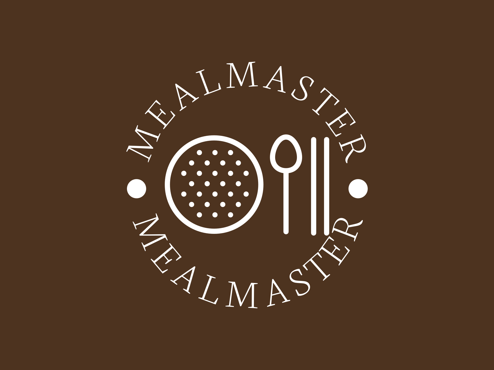
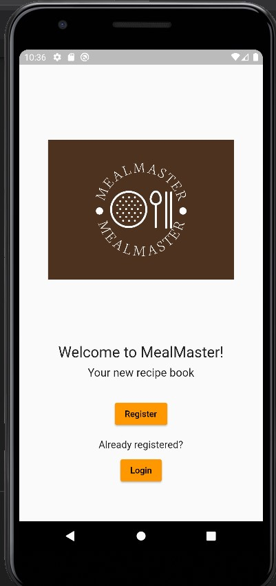
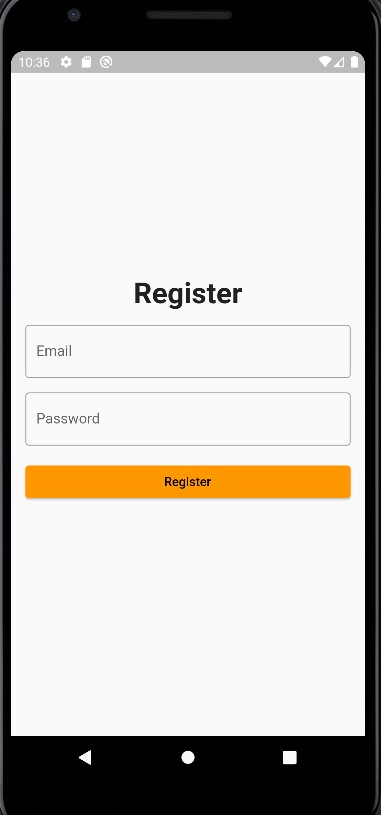
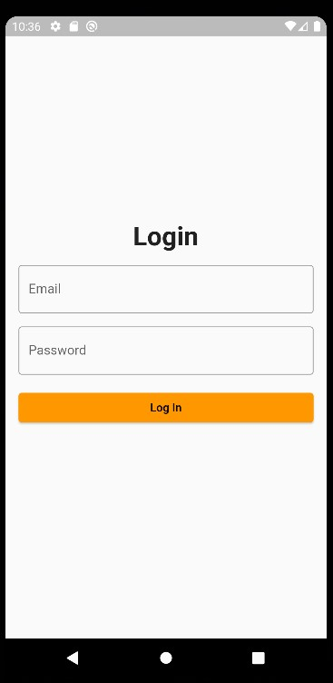
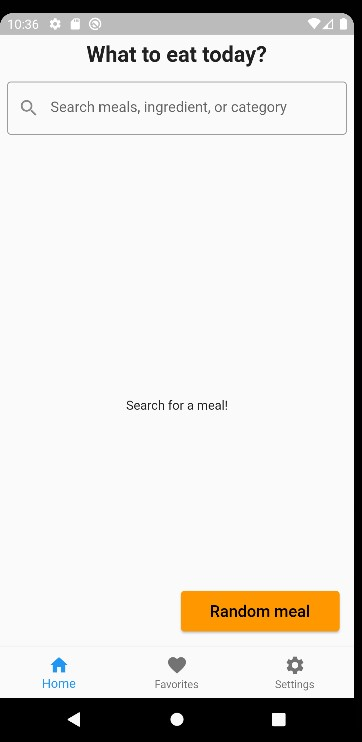
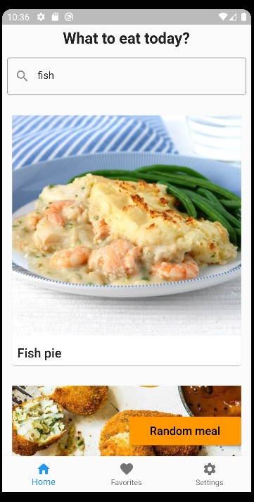
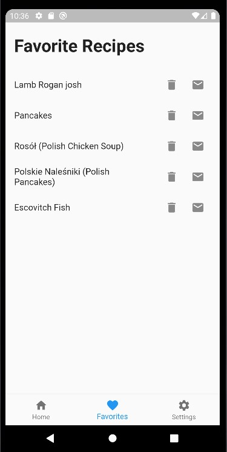
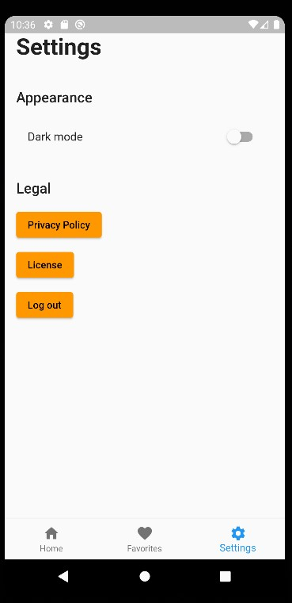
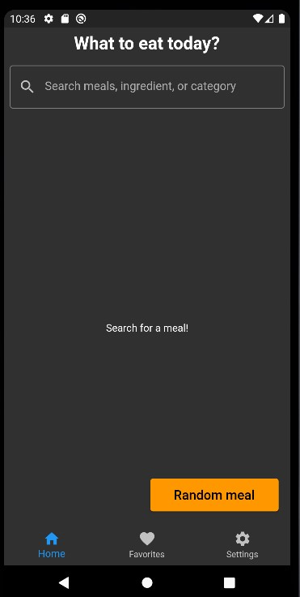
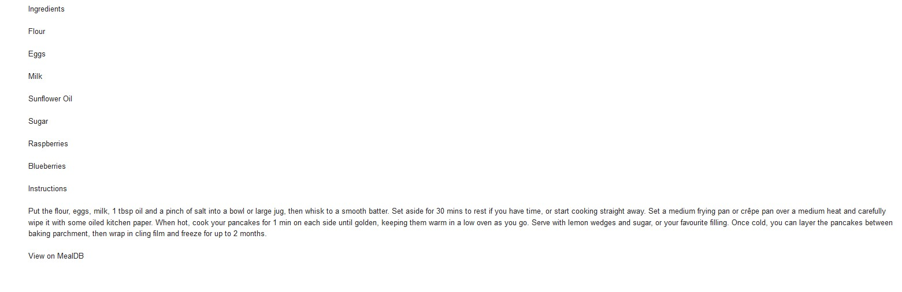

# MealMaster

MealMaster is a mobile app that helps users find and save their favorite recipes.

## Features

- Search for recipes by name, ingredient or category
- View detailed recipe information, including photo, ingredients and instructions
- Save favorite recipes to a personal collection
- Send favorite recipes to a friend via email
- Dark and light mode support
- Firebase authentication and user data storage

## Getting Started

to run the app locally, follow these steps:

- Clone the repository to your local machine
- Navigate to the project directory in your terminal
- Run flutter pub get to install dependencies
- Run flutter run to start the app in android emulator

Note: You will need to have Flutter and the Android/iOS development environment set up on your machine.

## Technologies Used
- Flutter
- Dart
- Firebase Authentication
- TheMealDB API
- Android emulator (Pixel 3a API 29)

## Screenshots

> *Welcome page*
  

> *Register page (Firebase auth).*
  

> *Login page (Firebase auth).*
  

> *Home screen where user can search recipes or get random recipes. Navbar makes navigation easy.*
  

> *Results for "fish" (MealDB).*
  

> *Favorite page. User can remove or send recipe via email.*
  

> *Settings page with working Dark/Light mode and Log out.*
  

> *Darkmode in Home page.*
  

> *Recipe received via email.*
  
